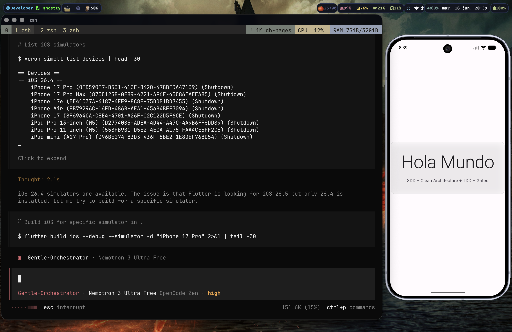

# Desarrollo Asistido por IA

Presentación sobre el ecosistema Gentle AI para desarrollo de software asistido por inteligencia artificial.

## Enlace a la Presentación

🔗 **[Ver Presentación en GitHub Pages](https://statick88.github.io/gentle-ai-taller/)**
🔗 **[Código Flutter (SDD)](https://github.com/statick88/flutter-sdd-hello-world)**

## Contenido

### Secciones Principales

| Sección | Descripción |
|---------|-------------|
| **Introducción** | Herramientas de IA para coding |
| **Gentle AI** | Ecosistema completo de desarrollo |
| **SDD** | Spec-Driven Development (10 fases) |
| **Engram** | Memoria persistente para agentes |
| **GGA** | Gentleman Guardian Angel (code review) |
| **UI/UX** | Principios de diseño de interfaces |
| **Referencias** | 13 referencias en formato IEEE |

### Herramientas Cubiertas

- **Gentle AI** - Ecosistema configurador para agentes de coding
- **Engram** - Sistema de memoria persistente (MCP)
- **GGA** - Review de código con IA (provider-agnostic)
- **SDD** - Spec-Driven Development workflow
- **OpenCode** - Asistente de coding terminal-first

## Imágenes del Proyecto

### Screenshot de la Aplicación



*Aplicación Flutter "Hola Mundo" desarrollada usando SDD con Clean Architecture y TDD.*

### Foto del Presentador


*Diego Medardo Saavedra García - FullStack Developer & Cybersecurity Consultant*

## Stack Tecnológico

### Presentación
- **RevealJS** 4.6.1 - Framework para presentaciones
- **Inter** - Tipografía principal
- **Fira Code** - Tipografía para código
- **Tema personalizado** - Dark theme con glassmorphism

### Aplicación Flutter
- **Flutter** 3.44.0
- **Dart** 3.12.0
- **Riverpod** - State management
- **Clean Architecture** - Domain / Data / Presentation
- **TDD** - Test-Driven Development

## Estructura del Proyecto

```
gentle-ai-taller/
├── index.html                 # Presentación principal
├── statick.png               # Foto del presentador
├── app-screenshot.png        # Screenshot de la app
├── README.md                 # Este archivo
├── .nojekyll                 # Configuración GitHub Pages
└── .git/                     # Repositorio Git
```

## Desarrollo Local

```bash
# Clonar repositorio
git clone https://github.com/statick88/gentle-ai-taller.git
cd gentle-ai-taller

# Abrir en navegador
open index.html

# O usar servidor local
python3 -m http.server 8000
```

## Despliegue

El proyecto se despliega automáticamente a GitHub Pages mediante push a la rama `gh-pages`.

```bash
# Actualizar presentación
git add .
git commit -m "feat: update presentation"
git push origin gh-pages
```

## Autor

**Diego Medardo Saavedra García**
- 🌐 [Portfolio](https://statick88.github.io)
- 💼 [LinkedIn](https://linkedin.com/in/dsaavedra88)
- 🐙 [GitHub](https://github.com/statick88)
- 📧 dsaavedra88@gmail.com

## Licencia

© 2024 Diego Saavedra. Todos los derechos reservados.
